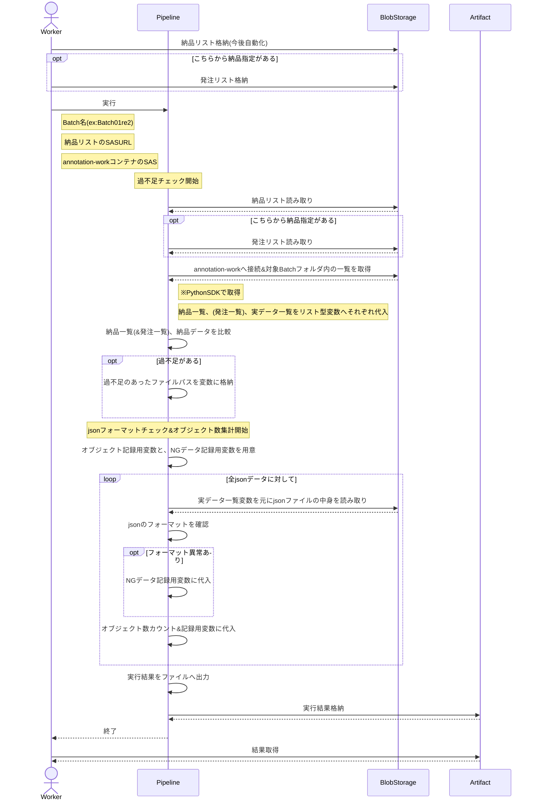

```mermaid
sequenceDiagram

actor wk as Worker
participant pl as Pipeline
participant bl as BlobStorage
participant af as Artifact

wk ->> bl: 納品リスト格納(今後自動化)
opt こちらから納品指定がある
wk ->> bl: 発注リスト格納 
end
wk ->> pl: 実行
note right of wk: Batch名(ex:Batch01re2)
note right of wk: 納品リストのSASURL
note right of wk: annotation-workコンテナのSAS
note over pl: 過不足チェック開始
pl ->> bl: 納品リスト読み取り
bl -->> pl: 
opt こちらから納品指定がある
pl ->> bl: 発注リスト読み取り
bl -->> pl: 
end
pl ->> bl: annotation-workへ接続&対象Batchフォルダ内の一覧を取得
bl -->> pl: 
note right of pl: ※PythonSDKで取得
note right of pl: 納品一覧、(発注一覧)、実データ一覧をリスト型変数へそれぞれ代入
pl ->> pl: 納品一覧(&発注一覧)、納品データを比較
opt 過不足がある
pl ->> pl: 過不足のあったファイルパスを変数に格納
end
note over pl: jsonフォーマットチェック&オブジェクト数集計開始
pl ->> pl: オブジェクト記録用変数と、NGデータ記録用変数を用意
loop 全jsonデータに対して
pl ->> bl: 実データ一覧変数を元にjsonファイルの中身を読み取り
bl -->> pl: 
pl ->> pl: jsonのフォーマットを確認
opt フォーマット異常あり
pl　->> pl: NGデータ記録用変数に代入
end
pl ->> pl: オブジェクト数カウント&記録用変数に代入
end
pl ->> pl: 実行結果をファイルへ出力
pl ->> af: 実行結果格納
af -->> pl: 
pl -->> wk: 終了
wk ->> af: 結果取得
af -->> wk:  

```